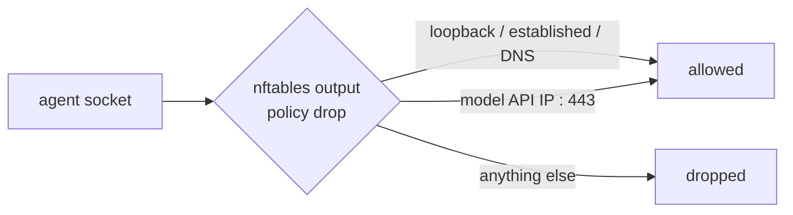

# ADR-002: Fail-closed nftables egress allowlist

**Status**: Accepted
**Owner**: maintainers
**Date**: 2026-06-25
**Supersedes**: —
**Superseded by**: —

## Context

Killing telemetry via environment variables stops the *cooperative* trace
surfaces — an agent CLI that reads `DISABLE_TELEMETRY` and obeys. It does
nothing against an agent (or a prompt-injected tool, or a compromised
dependency) that simply opens a socket to an arbitrary host and exfiltrates
code. A no-trace promise that only covers well-behaved code isn't worth much.

## Decision

In `--strict` mode (the default), `src/fugue-entry` installs an nftables `inet`
table whose `output` chain is `policy drop`. It then permits only: loopback,
established/related connections, DNS, and the startup-resolved A/AAAA records of
the profile's `API_HOSTS` on TCP 443. The container is granted `NET_ADMIN` only
long enough to install this table, then drops to the unprivileged user.

Crucially, strict mode is **fail-closed**: if `nft` is unavailable or
`NET_ADMIN` is missing, the entrypoint exits non-zero *before* the agent
starts. Hosts that can't grant `NET_ADMIN` must opt out explicitly with
`--no-net-isolation`.

## Consequences

**Positive**: code can't leave the box except to the model API, even if the
agent actively tries. The guarantee holds against malice, not just politeness.

**Negative**: the allowlist pins IPs at session start; an API whose IP set
rotates mid-session can lose connectivity (re-run to re-resolve). Strict mode
needs `NET_ADMIN`, which some hosts forbid.

**Neutral**: the startup DNS resolution of `API_HOSTS` is itself a visible
lookup — fugue is an amnesiac sandbox, not an anonymity network.

## Alternatives considered

- **Telemetry kill-env only.** Kept as the `--no-net-isolation` fallback, but
  rejected as the default: it can't stop a determined or compromised agent.
- **Fail-open strict mode** (warn and continue if the firewall can't install).
  Rejected: silently running unguarded under a flag named `--strict` is a lie.
- **Proxy-based egress filtering.** Heavier to run and another moving part with
  its own trust; nftables is in-kernel and simple.

## Open items deferred

Handling APIs that legitimately rotate IPs mid-session (periodic re-resolution,
or CIDR/hostname-aware filtering) is not decided here.
