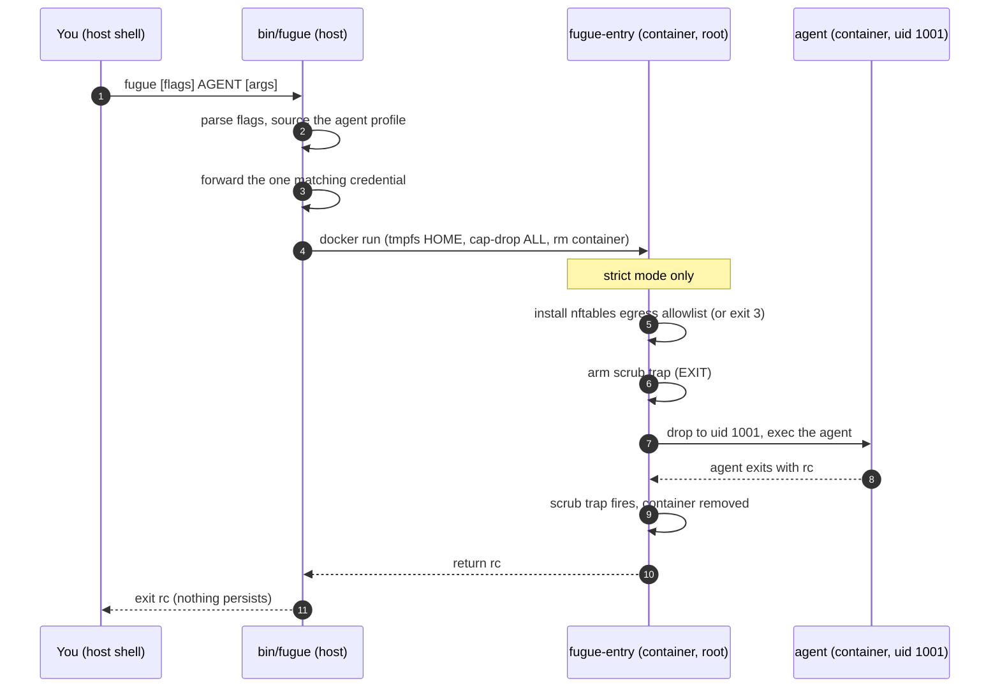

# Architecture

fugue is two scripts and an image. `bin/fugue` runs on the host and assembles a
hardened `docker run`; `src/fugue-entry` runs inside the container, installs the
egress allowlist, drops privileges, and execs the agent. The
[`Dockerfile`](../Dockerfile) builds the minimal runtime they need.

## The launcher: `bin/fugue`

1. **Parse flags**, stopping at the agent name. Everything after the agent name
   is the agent's own argv.
2. **Resolve the profile** `profiles/<agent>.env`. An unknown agent fails with
   the list of known ones (exit `2`).
3. **Forward one credential.** It walks the profile's `API_KEY_VARS` and adds
   `-e <VAR>` for the first one present in the host env. None present → exit `2`.
4. **Assemble `docker run`** with the hardening flags:
   - `--rm -it` — the container and everything in it is destroyed on exit.
   - `--tmpfs /home/agent:...,uid=1001,gid=1001,mode=0700` — an ephemeral
     `$HOME`; all agent state, history, and transcripts land here and die.
   - `--security-opt no-new-privileges` and `--cap-drop ALL` — minimal
     privilege.
   - `--cap-add NET_ADMIN` (strict only) — just enough for the entrypoint to
     install the firewall before it drops privileges.
   - the per-agent `TELEMETRY_ENV` plus the broad `DISABLE_AUTOUPDATER` /
     `DO_NOT_TRACK` kill switches.
   - the workspace mount: `-v $(pwd):/workspace` normally, or a throwaway
     `--tmpfs /workspace` under `--ephemeral-workspace`.
5. **Run** the image's `fugue-entry`, passing `AGENT_CMD` and the agent argv.
   The agent's exit code is captured and re-emitted as fugue's own.

## The entrypoint: `src/fugue-entry`

The entrypoint starts as root (only because installing nftables needs
`NET_ADMIN`) and ends as the unprivileged `agent` user.

1. **Install the egress allowlist** (`--strict` only). It writes an `inet`
   table whose `output` chain is `policy drop`, then allows loopback,
   established/related, and DNS. For each host in `FUGUE_ALLOW_HOSTS` it
   resolves every A/AAAA record at startup and pins `daddr <ip> tcp dport 443
   accept`. If `nft` is missing, it **exits `3` before launching the agent** —
   an incognito promise it can't keep is worse than none.
2. **Arm the scrub trap.** On `EXIT` it shreds common stray-state locations
   (`/tmp`, `/var/tmp`, `*.log`, `.bash_history`). This is belt-and-suspenders:
   the container is `--rm`, so the tmpfs `$HOME` vanishes regardless.
   `--keep-on-error` skips the scrub when the agent failed, for debugging.
3. **Drop privileges and exec.** It re-execs the agent as `agent:agent`
   (uid/gid 1001) via `su-exec`, falling back to `setpriv`. The agent never
   runs privileged.

## The image: `Dockerfile`

A `node:22-bookworm-slim` base with only what a session needs:

- `nftables` — the egress allowlist installed by the entrypoint.
- `ca-certificates` — TLS to the model API.
- `dnsutils` — host resolution for the allowlist.
- `su-exec` — the privilege drop after firewall setup.
- `git` and `curl` — agents need them; the host's git hooks are **not** carried
  in.
- the agent CLIs (`@anthropic-ai/claude-code`, `@openai/codex`,
  `@google/gemini-cli`).
- an unprivileged `agent` user at uid/gid 1001, matching the tmpfs mount.

Design rule: nothing in the image may phone home on its own — no managed git
hooks, no telemetry collector, no audit log. The only outbound traffic a
session can make is to the model API, and only when `--strict` allows it.

The reasoning behind these choices lives in [adr/](adr/).
