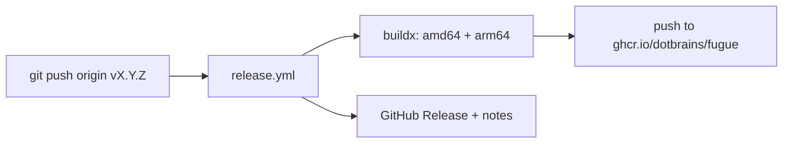

# Releasing

fugue's distributable artifact is the container image `ghcr.io/dotbrains/fugue`.
The `bin/fugue` launcher is run from a clone and pulls that image, so a release
means **publishing a versioned, multi-arch image to GHCR** (and a GitHub Release
for the notes). There is no separate binary or package to ship.

## How a release happens

Releases are tag-driven. Pushing a `v*` tag triggers
[`.github/workflows/release.yml`](../.github/workflows/release.yml), which:

1. logs in to GHCR with the workflow's built-in `GITHUB_TOKEN` (no external
   secrets),
2. builds the image for `linux/amd64` and `linux/arm64` (agents run on both),
3. tags it via `docker/metadata-action`, and pushes to GHCR,
4. creates a GitHub Release with auto-generated notes.



### Image tags produced

For a tag `vX.Y.Z` the workflow publishes:

| Tag                                  | When                                  |
| ------------------------------------ | ------------------------------------- |
| `ghcr.io/dotbrains/fugue:X.Y.Z`      | always                                |
| `ghcr.io/dotbrains/fugue:X.Y`        | always                                |
| `ghcr.io/dotbrains/fugue:latest`     | only for non-prerelease tags          |

A prerelease tag (e.g. `v0.2.0-rc.1`) publishes the version tags and is marked
as a prerelease, but does **not** move `latest`.

## Cut a release

1. Make sure `main` is green (`make check`) and the pinned versions are where
   you want them (see below).
2. Choose the next [semver](https://semver.org/) version.
3. Tag and push:

   ```sh
   git tag v0.1.0
   git push origin v0.1.0
   ```

4. Watch the `release` workflow in the Actions tab. When it's green, the image
   is live:

   ```sh
   docker pull ghcr.io/dotbrains/fugue:0.1.0
   ```

### First release only

GHCR creates the package on the first push. Afterwards, in the package
settings, confirm its visibility (public, to match the README) and link it to
this repository so the README badge and provenance resolve.

## Pinned versions and Dependabot

A tagged image must be reproducible, so the inputs that determine its contents
are pinned. [Dependabot](../.github/dependabot.yml) opens weekly PRs to bump
them, which is the normal way versions move:

| Pinned input          | Where                                   | Bumped by                     |
| --------------------- | --------------------------------------- | ----------------------------- |
| Agent CLIs            | `package.json` + `package-lock.json`    | Dependabot (`npm`)            |
| Base image digest     | `Dockerfile` `FROM …@sha256:…`          | Dependabot (`docker`)         |
| Workflow action versions | `.github/workflows/*.yml`            | Dependabot (`github-actions`) |
| su-exec source tag    | `Dockerfile` `ARG SU_EXEC_REF`          | manual (rare)                 |

Merging a Dependabot PR runs the full CI gate (including `make check:build`), so
a bad bump is caught before it can be released. The flow is: merge the bumps you
want → confirm CI is green on `main` → cut the tag.

To bump an agent CLI by hand, edit the version in `package.json`, regenerate the
lockfile, and rebuild:

```sh
npm install --package-lock-only --omit=dev
make check:build
```

## Rollback

Images are immutable per tag. To roll `latest` back, re-point consumers at a
known-good version tag (`ghcr.io/dotbrains/fugue:0.1.0`), or cut a new patch
release from a fixed commit. Don't delete published version tags — pin away from
them instead.
