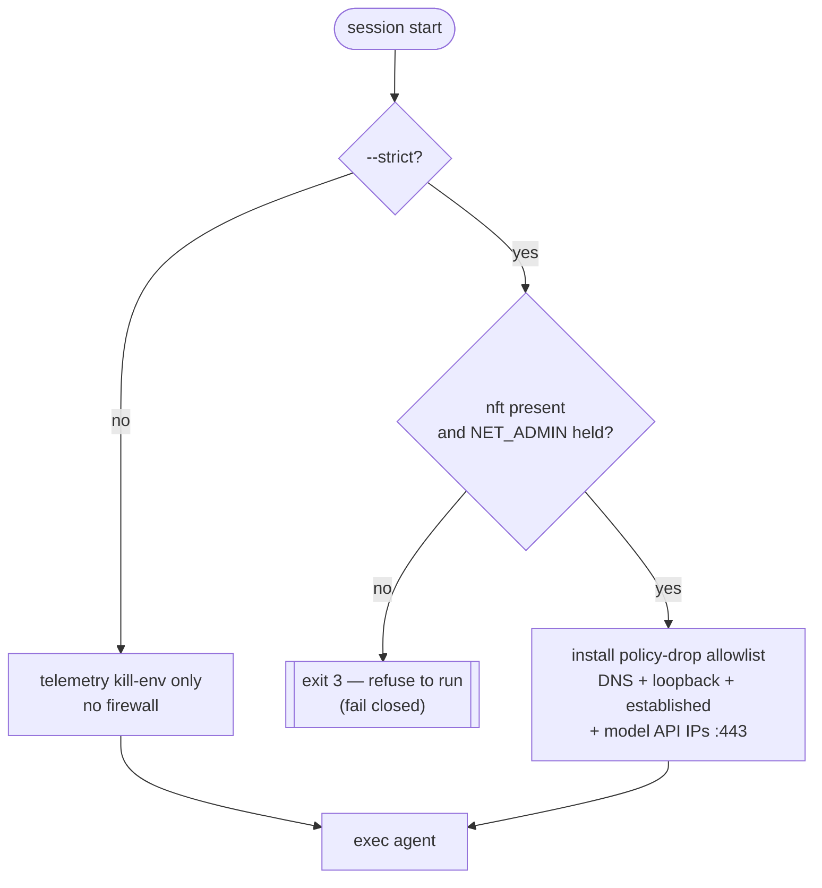

# Security

fugue gives an AI agent a *no-trace local session*. This page summarizes the
trust boundaries and the one contract that matters most — fail-closed strict
mode. The exhaustive analysis lives in the [threat model](threat-model.md); how
to report a vulnerability lives in [reference/SECURITY.md](reference/SECURITY.md).

## Trust boundaries

| Boundary                  | What fugue controls                                                        |
| ------------------------- | ------------------------------------------------------------------------- |
| Host ↔ container          | The container runs `--rm` with `--cap-drop ALL` and `no-new-privileges`. Only `NET_ADMIN` is added, only in strict mode, only until the firewall is up. |
| Container ↔ network       | In `--strict`, egress is `policy drop` except DNS, loopback, established, and the resolved model-API IPs on TCP 443. |
| Agent ↔ filesystem        | `$HOME` is tmpfs and dies on exit; a scrub trap shreds stray state; `--ephemeral-workspace` keeps the host working tree untouched. |
| Agent ↔ credentials       | Only the one credential named by the agent's `API_KEY_VARS` is forwarded, only for that run, never to disk, never across agents. |

## The `--strict` fail-closed contract

`--strict` is the default. In it, if nftables is unavailable or the container
lacks `NET_ADMIN`, `src/fugue-entry` exits non-zero **before** launching the
agent. An incognito promise that can't be enforced is worse than an honest
refusal. If your host can't grant `NET_ADMIN`, opt out explicitly with
`--no-net-isolation` and accept the weaker, env-only guarantee.

## What fugue does not defend against

fugue removes *local* trace and *lateral* egress. It does **not** hide the
authenticated API call from the provider, defend against a malicious base
image, hide the container from host-level observation, or anonymize the
startup DNS lookup. Read the [threat model](threat-model.md) before relying on
it for anything adversarial.

## Reporting a vulnerability

Please report privately — see [reference/SECURITY.md](reference/SECURITY.md). Do
not open a public issue for a suspected vulnerability.
